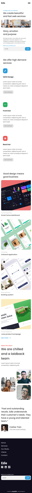

<!-- Please update value in the {}  -->

<h1 align="center">Edie Homepage</h1>

<div align="center">
   Solution for a challenge from  <a href="http://devchallenges.io" target="_blank">Devchallenges.io</a>.
</div>

<div align="center">
  <h3>
    <a href="https://claude1018.github.io/edie-homepage/">
      Demo
    </a>
    <span> | </span>
    <a href="https://devchallenges.io/solutions/AP1JweRUB5oKmcGC7ONX">
      Solution
    </a>
    <span> | </span>
    <a href="https://devchallenges.io/challenges/xobQBuf8zWWmiYMIAZe0">
      Challenge
    </a>
  </h3>
</div>

<!-- TABLE OF CONTENTS -->

## Table of Contents

- [Overview](#overview)
  - [Built With](#built-with)
- [Features](#features)
- [How to use](#how-to-use)
- [Contact](#contact)

<!-- OVERVIEW -->

## Overview





### Built With

- Mobile-first Workflow
- Semantic HTML
- CSS Grid and Flexbox
- [GulpJS](https://gulpjs.com/) - for task automation
- [SASS](https://sass-lang.com/) - CSS Preprocessor
- [PostCSS](https://postcss.org/) - For autoprefixing and minifying css

## Features


This application/site was created as a submission to a [DevChallenges](https://devchallenges.io/challenges) challenge. The [challenge](https://devchallenges.io/challenges/xobQBuf8zWWmiYMIAZe0) was to build an application to complete the given user stories.

- User story: I can see a page following the given design
- User story: I can see a page on mobile following the given design
- User story: I can go to certain locations by selecting links in navigation or footer

## How To Use

To clone and run this application, you'll need [Git](https://git-scm.com) and [Node.js](https://nodejs.org/en/download/) (which comes with [npm](http://npmjs.com)) installed on your computer. From your command line:

```bash
# Clone this repository
$ git clone https://github.com/claude1018/edie-homepage

# Install dependencies
$ npm/yarn install

# Run the app
$ npm/yarn start
```

## Contact

- GitHub [@claude1018](https://github/claude1018)

